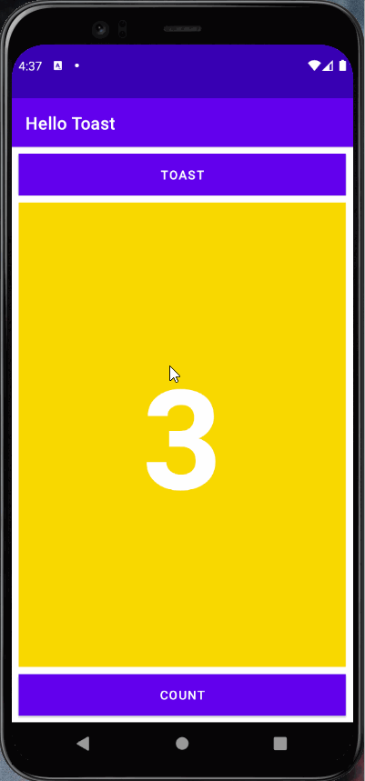
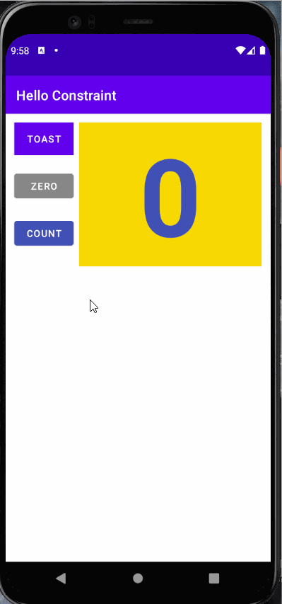

# Lab-2-HelloToast2

### Hello Toast2 Application Overview

- Application Index Portrait

- Application Index Landscape

- Application Index Tablet Portrait

- Application Index Tablet Landscape

### Hello Toast2 Application Workings

- Count Button Portrait

- Count Button Landscape

- Count Button Tablet Portrait

- Count Button Tablet Landscape

- Toast Button Portrait

- Toast Button Landscape

- Toast Button Tablet Portrait

- Toast Button Tablet Landscape

# Lab-2-HelloToastChallenge2

### Hello ToastChallenge 2 Application Overview

- Application Index (Linear Layout)

- Application Index (Relative Layout)

### Hello Toast Challenge2 Application Workings

- Count Button (Linear Layout)

- Count Button (Relative Layout)

- Toast Button (Linear Layout)

- Toast Button (Relative Layout)

# Lab-2-HelloConstraint

### HelloConstraint Application Overview

- Application Index Portrait

- Application Index Landscape

### HelloConstraint Application Workings

- Count Button Portrait

- Count Button Landscape

- Zero Button Portrait

- Zero Button Landscape

- When Number Is Even Portrait

- When Number Is Even Landscape

- When Number Is Odd Portrait

- When Number Is Odd Landscape

